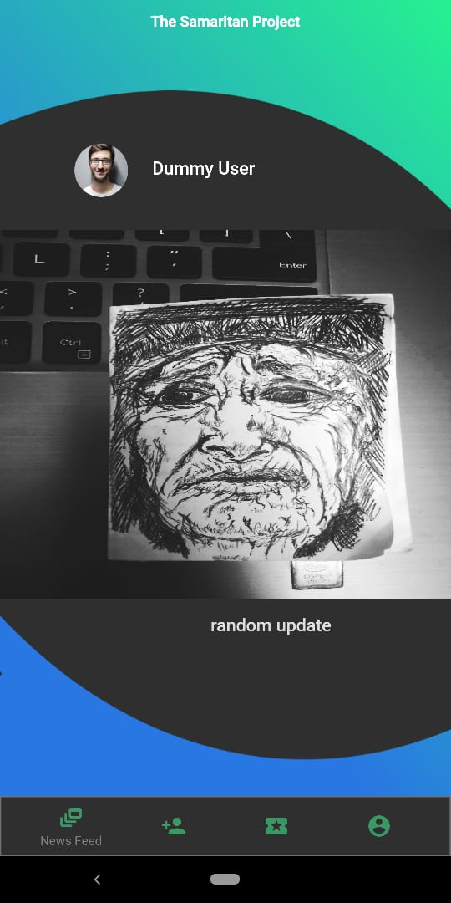
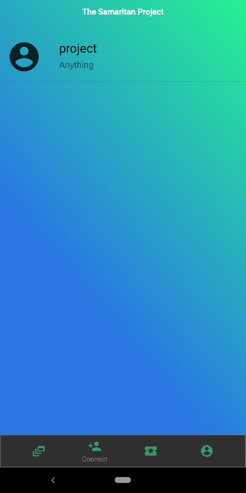
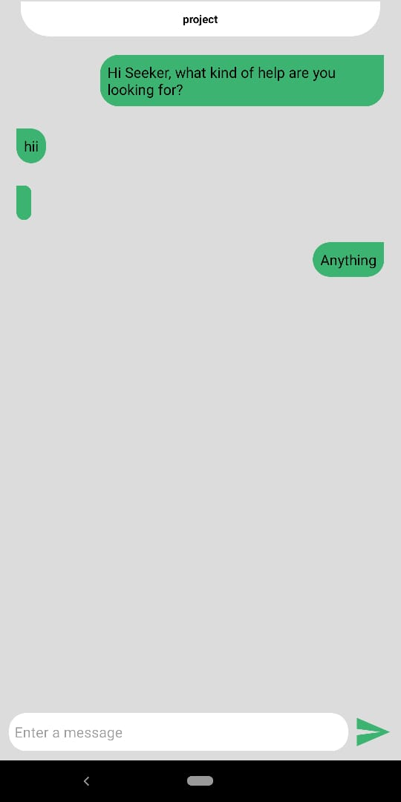
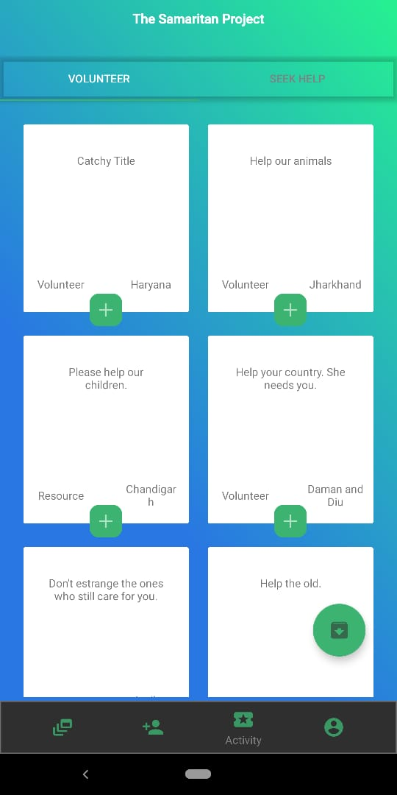
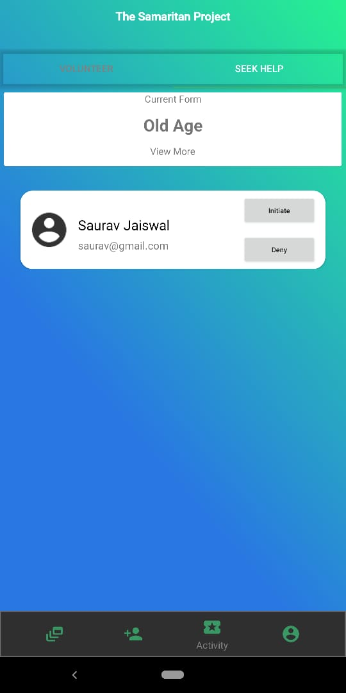

# TheSamaritanProject

An android application to fulfill the need of connecting NGOs around the globe. The USP of this project is the Activity feature that we have built. This feature can help the NGOs to Seek-Help and Volunteer in various activities around the globe. Some other sections that are implemented in this application are: News Feed, Chat and Profile. This project is in a preliminary stage. A lot of sections like Message Encryption, Cloud Functions Integration and Notifications need some work right now but we have some great ideas in store for the future.

## Motivation
---------------------

In today’s world where we consume disasters, natural calamities, and economic slow-down in the form of news every single day NGOs become extremely crucial for us and the world we live in. To set the context, I would like to shed some light on the working conditions of most of the NGOs around us. 

In general, NGOs never have enough resources. They always start with an aim of doing good for others but unfortunately, we don’t do enough for them. NGOs generally lack the size of the workforce, supplies, publicity, permissions, etc. With all these scarcities, these necessitous Samaritans who try to work selflessly either for us, animals or the environment should be given the opportunities and help that they deserve. For doing so, we as a group have come up with this project to create a network of NGOs who can do the good that they have already committed themselves to, in a collective manner, with more help from similar organizations and other volunteers.


## Solution
-------------------

The primary objective of this project is to build an android application that can bring together the small NGOs around our nation in the constructive work which they do at the individual level. Our objectives through this project are:
1. Increase collaboration among small NGOs.
2. Promote volunteering culture among common people.
3. Increase transparency in the work of NGOs through the feature of posting real-time updates on the app.
4. Create a common interface where Samaritans can extend help and NGOs can seek help in the form of the workforce, non-monetary resources, information, etc.
5. Provide seamless clutter-free coordination between the volunteers.

## Application Screenshots
-------------------

<table>
  <tr>
    <td>News Feed</td>
     <td>Connect</td>
     <td>Chat Log</td>
  </tr>
  <tr>
    <td></td>
    <td></td>
    <td></td>
  </tr>
 </table>
 <br>
 <table>
  <tr>
     <td>Volunteer</td>
     <td>Seek Help</td>
  </tr>
  <tr>
    <td></td>
    <td></td>
  </tr>
 </table>
 

## Installation
-------------------
1. Clone this repository and import into **Android Studio**
```bash
git clone https://github.com/MrRobo24/TheSamaritanProject
```
2. Link it with Google Firebase Project
 **Read:** https://firebase.google.com/docs/android/setup
3. Generate and put google-services.json file in [TheSamaritanProject/app/](/app/)
4. Import this structure in Realtime Database: [the-samaritans-export.json](the-samaritans-export.json)
